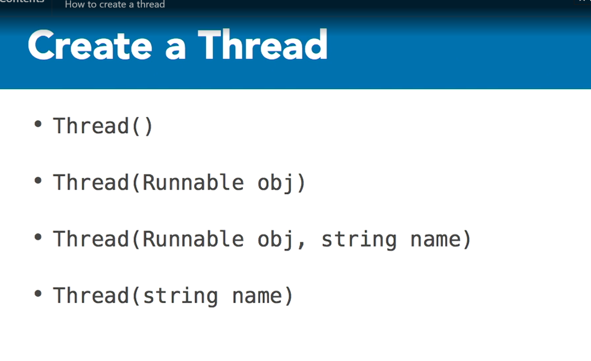

# Java Threads
# linkedin java threads
[course](https://www.linkedin.com/learning/learning-java-threads)

# thread
- start asynchronous task
    - they can run concurrently  

  
- default main thread
- handle well
    - threads for intensive calculus
    - thread for user interaction
    - keep the application responsive to the user

- each thread has it's own JVM stack

# runnable
- code sequence
- thread executes a runnable
  

# thread types

# thread non daemon
prevent JVM to finish the program
- the threads are non daemon by default

# thread daemon
does not prevent JVM to finish the program

# thread lifecycle
- main thread is the started and endpoint of the application
- once the main thread finish, the JVM terminates the execution

# thread wait
- t.wait():  
    used when you wait for a thread to finish
  

sleep
- Thread.sleep()
  
```java
Thread.sleep(1000);
```

# thread State
# thread state properties
- name
- alive/dead
- daemon/non-daemon
- executionState
- priority

```java
Thread t1 = new Thread(() -> {
    System.out.println("Task1 running");
});
t1.getState();
t1.start();
```

# thread execution state
there are six states: 

- NEW: thread is created but not started
- RUNNABLE: thread is started but not yet running
- BLOCKED: thread is waiting for a resource
- WAITING: thread is waiting for another thread
- TIMED_WAITING: thread is waiting a certain time
- TERMINATED: thread is finished
```java
Thread t1 = new Thread(() -> {
    Thread current = Thread.currentThread();
    System.out.printf("%s is alive : %s", current.getName(), String.valueOf(current.isAlive()));

    System.out.printf("%s state : %s", current.getName(), current.getState());

    System.out.printf("%s priority : %s", current.
    getName(), current.getPriority());
}); 

Thread t2 = new Thread(() -> {
    Thread current = Thread.currentThread();
    System.out.printf("%s is alive : %s", current.getName(), String.valueOf(current.isAlive()));

    System.out.printf("%s state : %s", current.getName(), current.getState());

    System.out.printf("%s priority : %s", current.
    getName(), current.getPriority());
}); 

Thread t3 = new Thread(() -> {
    Thread current = Thread.currentThread();
    System.out.printf("\n%s is alive : %s\n", current.getName(), String.valueOf(current.isAlive()));

    System.out.printf("\n%s state : %s\n", current.getName(), current.getState());

    System.out.printf("\n%s priority : %s\n", current.
    getName(), current.getPriority());
}); 

t1.start();
t2.start();
Thread.sleep(1000);
t3.start();
```

three threads long running execute
```java
class Task extends Thread {
    public Task(){}

    public Task(String name){
        this.setName(name);
    }

    public void run(){
        long i=0;
        while(i<100_000_000_000L){
            i++;
            try{
                if(i%10_000_000_000L==0){
                    System.out.println(Thread.currentThread().getName()+ " running "+i);
                }
            }catch(Exception e){
                e.printStackTrace();
            }
        }
    }
}
Thread t1 = new Task("uno");
Thread t2 = new Task("dos");
Thread t3 = new Task("tres");
t1.start();
t2.start();
t3.start();
```

threads with a thread controller
- thread monitor is required to manipulate other threads
    - therefore you need to use synchronized in your method
# thread wait
when you run t.wait(), the parent thread is blocked until the child is finish

```java
class Task extends Thread {
    public Task(){}

    public Task(String name){
        this.setName(name);
    }

    public synchronized void esperar(){
        try{
            this.wait();
        }catch(Exception e){
            e.printStackTrace();
        }
    }

    public void run(){
        long i=0;
        while(i<100_000_000_000L){
            i++;
            try{
                    System.out.println(Thread.currentThread().getName()+ " running "+i);
                }
            }catch(Exception e){
                e.printStackTrace();
            }
        }
    }
}
try{
    Task t1 = new Task("uno");
    Task t2 = new Task("dos");
    Task t3 = new Task("tres");
    
    t1.start();
    t2.start();
    t2.esperar();
    System.out.println("________start_3_____________");
    t3.start();
}catch(Exception e){
    e.printStackTrace();
}
```

# thread priority
value between 1-10
the priority is 5 by default

MIN_PRIORITY=1
NORM_PRIORITY=5
MAX_PRIORITY=10

# thread sample - putting to wait and long running
```java
class Task extends Thread {
    public Task(){}

    public Task(String name){
        this.setName(name);
    }

    public synchronized void esperar(){
        try{
            this.wait();
        }catch(Exception e){
            e.printStackTrace();
        }
    }

    public void run(){
        long i=0;
        while(i<100_000_000_000L){
            i++;
            try{
                if(i%10_000_000_000L==0){
                    System.out.println(Thread.currentThread().getName()+ " running "+i);
                }
            }catch(Exception e){
                e.printStackTrace();
            }
        }
    }
}

Task t1 = new Task("uno");
Task t2 = new Task("dos");
Task t3 = new Task("tres");

Thread tController = new Thread(() -> {
    try{
        t1.start();
        t2.start();
        t2.esperar();
        System.out.println("________start_3_____________");
        t3.start();
    }catch(Exception e){
        e.printStackTrace();
    }
}, "controller"); 

public static void showInformation(Thread t, int i){
    System.out.println(i+":name:"+t.getName()+",priority:"+t.getPriority
    ()+",state:"+t.getState());
}

new Thread(() -> {
    try{
        int i=0;
        while(true){
            i+=1;
            showInformation(tController, i);
            showInformation(t1, i);
            showInformation(t2, i);
            showInformation(t3, i);
            
            Thread.sleep(5000);
        }
    }catch(Exception e){
        e.printStackTrace();   
    }
}).start(); 
tController.start();
```

# thread sample with priority
```java
class Task extends Thread {
    public Task(){}

    public Task(String name){
        this.setName(name);
    }

    public synchronized void esperar(){
        try{
            this.wait();
        }catch(Exception e){
            e.printStackTrace();
        }
    }

    public void run(){
        long i=0;
        while(i<100_000_000_000L){
            i++;
            try{
                if(i%10_000_000_000L==0){
                    System.out.println(Thread.currentThread().getName()+ " running "+i);
                }
            }catch(Exception e){
                e.printStackTrace();
            }
        }
    }
}

Task t1 = new Task("uno");
t1.setPriority(Thread.MIN_PRIORITY);
Task t2 = new Task("dos");
t2.setPriority(Thread.MAX_PRIORITY);
Task t3 = new Task("tres");

Thread tController = new Thread(() -> {
    try{
        t1.start();
        t2.start();
        t2.esperar();
        System.out.println("________start_3_____________");
        t3.start();
    }catch(Exception e){
        e.printStackTrace();
    }
}, "controller"); 

public static void showInformation(Thread t, int i){
    System.out.println(i+":name:"+t.getName()+",priority:"+t.getPriority
    ()+",state:"+t.getState());
}

new Thread(() -> {
    try{
        int i=0;
        while(true){
            i+=1;
            showInformation(tController, i);
            showInformation(t1, i);
            showInformation(t2, i);
            showInformation(t3, i);
            
            Thread.sleep(5000);
        }
    }catch(Exception e){
        e.printStackTrace();   
    }
}).start(); 
tController.start();
```
- the thread with highest priority is executed first

# thread implementation
  
- you should override run method
    - no matter if you use, thread or runnable

# create a thread
using "extend thread"
```java
class Task1 extends Thread {
    public void run() {
        System.out.println("Task1 running");
    }
}
Thread t1 = new Task1();
t1.start();
```

using "implements runnable"
```java
class Task1 implements Runnable {
    public void run() {
        System.out.println("Task1 running");
    }
}
Thread t1 = new Thread(new Task1());
t1.start();
```

using runnable anonymous
```java
Thread t1 = new Thread(new Runnable() {
    public void run() {
        System.out.println("Task1 running");
    }
});
t1.start();
```

using runnable lambda
```java
Thread t1 = new Thread(() -> {
    System.out.println("Task1 running "+Thread.currentThread().getName());
}, "thread-lambda"); 
t1.start();
```

#  thread methods
static methods (current thread)
class methods (thread object)
  

```java
Thread.activeCount(); 
Thread.currentThread(); 
```

# thread join
put the current thread to wait the called thread

# thread interrupt
interrupt the execution of the called thread

```java
class Task extends Thread {
    public Task(){}

    public Task(String name){
        this.setName(name);
    }

    public synchronized void esperar(){
        try{
            this.wait();
        }catch(Exception e){
            e.printStackTrace();
        }
    }

    public void run(){
        long i=0;
        while(i<100_000_000_000L){
            i++;
            try{
                if(i%10_000_000_000L==0){
                    System.out.println(Thread.currentThread().getName()+ " running "+i);
                }
            }catch(Exception e){
                e.printStackTrace();
            }
        }
    }
}

Task t1 = new Task("uno");
Task t2 = new Task("dos");
Task t3 = new Task("tres");

Thread tController = new Thread(() -> {
    try{
        t1.start();
        t2.start();
        t2.join();
        System.out.println("________start_3_____________");
        t3.start();
    }catch(Exception e){
        e.printStackTrace();
    }
}, "controller"); 

public static void showInformation(Thread t, int i){
    System.out.println(i+":name:"+t.getName()+",priority:"+t.getPriority
    ()+",state:"+t.getState());
}

new Thread(() -> {
    try{
        int i=0;
        while(true){
            i+=1;
            showInformation(tController, i);
            showInformation(t1, i);
            showInformation(t2, i);
            showInformation(t3, i);
            t3.interrupt();
            t1.interrupt();
            t2.interrupt();
            Thread.sleep(5000);
        }
    }catch(Exception e){
        e.printStackTrace();   
    }
}).start(); 
tController.start();
```

# synchronization
- race conditions
- data races
- cached variable problems
- shared resources
    - prevent to threads to access to a critical resource
    - update shared variables

# synchronization : problem
when resource is not protected, it cause race condition problem

  

```java
long counter = 0;
public static long plusCounter(){
    return counter++;
}

plusCounter();

Thread t1 = new Thread(() -> {
    System.out.println("Task1 running");
    for(int i=0;i<1_000_000_000L;i++)
        plusCounter();
    System.out.println("t1 finish");
}); 

Thread t2 = new Thread(() -> {
    System.out.println("Task1 running");
    for(int i=0;i<1_000_000_000L;i++)
        plusCounter();
    System.out.println("t2 finish");
}); 

t1.start();
t2.start();

System.out.println(counter); 
```

# synchronization : solution
the solution is to use synchronized, then the critical section will be protected by a monitor
```java
class Sample{
    long counter = 0;
    public synchronized long plusCounter(){
        return counter++;
    }
}

Sample s = new Sample();

Thread t1 = new Thread(() -> {
    System.out.println("Task1 running");
    for(int i=0;i<1_000_000_000L;i++)
        s.plusCounter();
    System.out.println("t1 finish");
}); 

Thread t2 = new Thread(() -> {
    System.out.println("Task1 running");
    for(int i=0;i<1_000_000_000L;i++)
        s.plusCounter();
    System.out.println("t2 finish");
}); 

t1.start();
t2.start();

System.out.println(s.counter); 
```

# synchronization using static
```java
class Sample{
    public static long counter = 0;
    public static synchronized long plusCounter(){
        return counter++;
    }

    public void add(){
        plusCounter();
    }
}


Thread t1 = new Thread(() -> {
    Sample s = new Sample();
    System.out.println("Task1 running");
    for(int i=0;i<1_000_000_000L;i++)
        s.add();
    System.out.println("t1 finish");
}); 

Thread t2 = new Thread(() -> {
    Sample s = new Sample();
    System.out.println("Task2 running"); 
    for(int i=0;i<1_000_000_000L;i++)
        s.add();
    System.out.println("t2 finish");
}); 

t1.start();
t2.start();

Sample.counter;
```
the monitor protects static objects as well

# critical section
- code who needs to run serial
- java ensures it with monitors

# java monitor
  
- control access to a critic al section
- if the monitor is locked, the thread is blocked
- shared variable live on thread working memory
    - ensure access to recent values

# synchronized block
protects the whole object
  
```java
class Sample{
    long counter = 0;
    public long plusCounter(){
        return counter++;
    }
    public long plusCounter2(){
        return counter++;
    }
}

Sample s = new Sample();

Thread t1 = new Thread(() -> {
    synchronized(s){
        for(int i=0;i<1_000_000_000L;i++)
            s.plusCounter();
    }
}); 

Thread t2 = new Thread(() -> {
    synchronized(s){
        for(int i=0;i<1_000_000_000L;i++)
            s.plusCounter2();
    }
}); 

t1.start();
t2.start();
s.counter;
```

# thread wait and notify
- wait: pause the thread
  

- notify: unpause the thread
  
- the process to activate again the thread depends of the object condition queue

# thread wait and notify : what you need?
you can invoke wait just if you are the owner of the monitor
```java
long counter = 0L;
Thread t = new Thread(() -> {
    System.out.println("Task_00 running");
    for(int i=0;i<1_000_000_000L;i++)
        counter++;
    System.out.println("Task_00 finish");
}); 
t.start();

Thread t1 = new Thread(() -> {
    System.out.println("Task_01 running");
    synchronized(t){
        try{
            for(int i=0;i<500_000_000L;i++)
            counter++;
            System.out.println("t0 to wait");
            t.wait();

            for(int i=0;i<500_000_000L;i++)
                counter++;
            
            System.out.println("t0 to resume");
            t.notify();    
        }catch(Exception e){
            e.printStackTrace();        
        }
    }
}); 
t1.start();
Thread.sleep(1000);
synchronized(t){
    t.notify();
}
counter;
```

# IlegalMonitorStateException
- if you try to access to a monitor that is locked by another thread

# DeadLock
  


# Concurrency utilities
- thread pool
- async task
- collection class for optimized concurrent access

# Concurrency utilities : what solves
- performance hight thread soft
- reliability hight thread soft
- prevent deadlock, starvation, race condition

# starvation
  

# Concurrency utilities : Executor
- thread pool
- separate create and management from main
- worker thread to minimize overhead

## Executor interface
## ExecutorService interface
- executor handle all threads for you and wait for them to finish
```java
ExecutorService executor = Executors.newFixedThreadPool(10);
for(int i=0;i<10;i++){
    final int ii = i;
    executor.execute(() -> {System.out.println("Task running "+ii);
        for(int j=0;j<1_000_000_000L;j++);
        System.out.println("Task finish "+ii);
    });
}
executor.shutdown();
while(!executor.isTerminated());
System.out.println("i finish");
```
- Executors.newFixedThreadPool(10);
- executor.execute(() -> {});
- executor.shutdown();
- executor.isTerminated();

- once there is some space in the poll, it continues executing more runnables

## Schedule interface
future or periodic task

# Concurrency utilities : synchronizers
# synchronizers : latches
# countDownLatch
good pattern, let you wait for n threads, and then execute other thread
  
  
  
```java
public class Worker extends Thread {
    private final CountDownLatch counter;
    private final int i;

    Worker(CountDownLatch counter, int i) {
        this.counter = counter;
        this.i = i;
    }

    public void run() {
        try
        {
            Thread.sleep(3000*this.i);
            System.out.println("work done "+i); 
            counter.countDown();
        }catch (InterruptedException ie){
            System.err.println(ie);
        }
    }
}

CountDownLatch counter = new CountDownLatch(4);

for(int i=1;i<30;++i){
    new Thread(new Worker(counter, i)).start();
}

try{
    counter.await();
    System.out.println("ya termino el proceso");
}catch(Exception e){
    e.printStackTrace();
}
```

# Future
```java
ExecutorService executor = Executors.newSingleThreadExecutor();
public Future<Integer> calculate(Integer input) {
    return executor.submit(() -> {
        Thread.sleep(1000);
        return input * input;
    });
}
Future<Integer> future = calculate(10);

while(!future.isDone()) {
    System.out.println("Calculating...");
    Thread.sleep(300);
}

Integer result = future.get();
result;
```

# synchronizers : barriers

# synchronizers : semaphores

# synchronizers : exchanges

# Concurrency utilities : for / join framework

# Concurrency utilities : concurrent collection

# Concurrency utilities : atomic variables

# Concurrency utilities : Locks

# Locking Framework
# Lock
  

# ReentrantLock
# Condition
# ReadWriteLock
# ReentrantReadWriteLock

